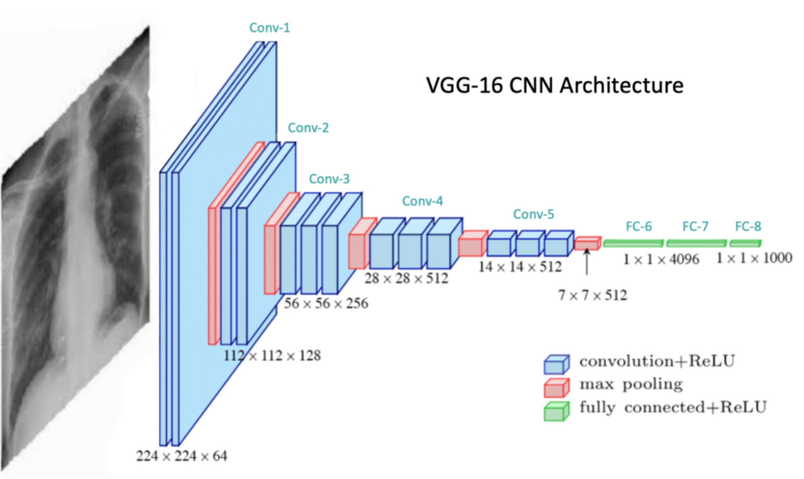
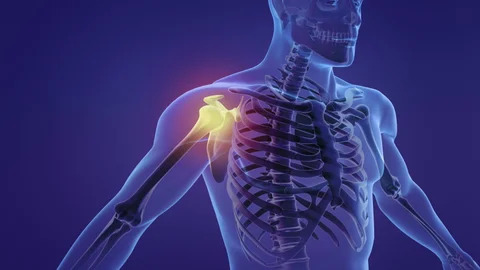
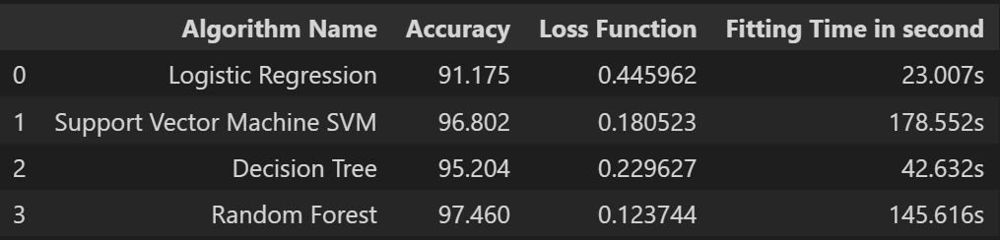

# **I Care - Smart Doctor**
Comprehensive Medical System - Easy Healthcare for Anyone Anytime!

(Graduation Project)

## 1. OverView

### Test Run Video
video here

---

As a team leader i have distributed the tasks on the team members, i have decided to work with Agile methodology so i was making a meeting each one or two weeks with the team members to presenting the work done
i was responsible for the AI modules which are:

### My part in the project consists of three main modules:

* **Module 1:** An AI based smart chatbot called "Caroline" talking to the patient 
and taking its disease symptoms by text or voice messages, then diagnosing the disease and 
recommend making some tests or medical imaging scans to do as x-ray, MRI, Complete Blood Count CBC, ... in addition, given 
information about the predicted disease as an overview, symptoms, and 
treatments. It can predict 30 diseases such as (Breast Cancer, Influenza, Covid 19, Stroke, ...) 

* **Module 2:** A sequence of AI Computer Vision models for scanning medical 
imaging scans and medical tests it can scan (X-ray, MRI, CT, OCT, CBC, or Food images), 
detect the image type (Image Recognition), if it is medical imaging image, 
applying anatomical recognition, disease evaluation, disease diagnosis, and also in tumor or bone fraction cases. It can locate the tumor or the fraction using image segmentation. It can predict 25 disease types such as (Bone Fracture, Brain Tumor, Covid 19, Breast Cancer, ...). It can read the Complete Blood Count (CBC) test images and evaluate overall health and diagnose conditions like anemia, infections, clotting disorders, and blood cancers by analyzing red and white blood cells, hemoglobin, hematocrit, and platelets. It also can recognize 101 food types from images and shows the approximate number of calories per gram.

* **Module 3:** An ensemble Machine Learning (Random Forest) Model for scan Electrocardiography ECG and diagnosis the heart diseases.

* In addition of making algorithm for MBTI personality analysis test.

## 2. Implementation Methodology
Using transfer learning to get a pre-trained models on a huge dataset image net and customize their input layer shape to be suitable with the images and customize the output layer structure and activation function as need, so the models have an initial value for the parameters then they train faster and gives better accuracy. 

The AI module is designed in different parts. There are a Natural Language Processing NLP, Deep Learning Computer Vision Classification, Image Segmentation, Optical Character Recognition OCR, Large Language Model LLM, Speech Recognition, and Machine Learning Models all are combined together to mimic a doctor for all specialties.

**AI Models Table**

Contains Input, Output, Functionality, Training and Testing Accuracy, and Recall information

---

**AI Scan Models Work Flow**

Sequence for the Image Scan Computer Vision Models

---

### **ChatBot Diseases Detection**

[//]: # ""

  

AI based smart chatbot called "Caroline" talking to the patient and taking its disease symptoms by text or voice messages, then diagnosing the disease and recommend making some tests or medical imaging scans to do as x-ray, MRI, Complete Blood Count CBC, ... in addition, given information about the predicted disease as an overview, symptoms, and treatments.

**Methodology:** Collecting the data from several datasets contains the diseases symptoms and the disease diagnosis as a Json format contains Tags, Patterns, and Response. The tags contains the class name as "greeting", "diseases name as Skin Cancer,  Influenza, ..." making class for each disease, patterns contains examples of the user expected questions, and the response contains the many options for the output. after making the dataset, applying preprocessing techniques (Tokenization and Stemming, ...). i have developed a deep learnoing LSTM model for the Chatbot predictions taking the preprocessed patient symptoms message as input and predict the class from the 44 classes then chooses randomly from the saved responses.

There is option speech to the chatbot using voice messages as i have add a Speech Recognition model to detect voices and convert it into text then pass to the chatbot model.

**Chatbot LSTM Architecture**

---

### **Object Recognition From Iamges**

Identify the medical imaging scan, medical test report and food from images

**Methodology:** Collecting the data from several datasets for the four classes starting with making a folder contains four other folders each onr for each class (Medical Imaging Scan, Medical Test Report, Food, Other). i have collected many types of medical imagings as (xray on several body parts, MRI on brain and breast, many food images from Food 101 dataset collectingh 100 images from each food type, and using the dataset **"ImageNet"** for class "Other" collecting 10 images from each of its 1000 classes). finally worked normally to made a deep learning CNN model VGG16 architecture with 4 neurons in the output layers and activation function Softmax.

**Models CNN Architecture**

---

### **Medical Imaging Scan Type Detection**

Identifying the medical imaging scan type of 4 main types which are 'Electromagnetic Variations - Xray', 'Magnetic Resonance Imaging - MRI', 'Computerized Tomography - CT', or 'Optical Coherence Tomography - OCT'

**Methodology:** Developed a multi-class classification CNN model VGG16 architecture for identifying 4 classes (xray, MRI, CT, or OCT Scan) with 4 neurons in the output layers and activation function Softmax.

---

### **Anatomical Recognition From Xray Scan**

Applying anatomical recognition on all imaging types to identify the body parts

**Methodology:** Developed two CNN model VGG16 architecture one for multi-class classification for the X-ray body parts with classes (Chest, Feet, Hand, Neck, Other, and Skull) with 6 neurons in the output layers and activation function Softmax. And the other one for binary-class classification for the MRI body parts with classes (Brain and Breast) with 1 neuron in the output layers and activation function Sigmoid.

---

### **Brain Tumor Detection From MRI Scan**

Can to detect brain tumor from MRI and diagnosis their types as 'Glioma_tumor', 'Meningioma_tumor', and 'Pituitary_tumor'

**Methodology:** Developed two models the first one is a binary-classification CNN model VGG16 architecture for the MRI Brain Tumor Evaluation with classes (Tumored and Not Tumored) with 1 neuron in the output layers and activation function Sigmoid. and the second one for multi-class classification CNN model VGG16 architecture for the MRI Brain Tumor Type Detection with 3 classes with 3 neurons in the output layers and activation function Softmax.

---

### **Bone Fracture Detection From Xray Scan**

Can to detect bones fraction from x-rays and diagnosis their 10 types as 'Avulsion fracture', 'Comminuted fracture', 'Compression-Crush fracture', 'Fracture Dislocation', 'Greenstick fracture', 'Hairline Fracture', 'Impacted fracture', 'Intra-articular fracture', 'Longitudinal fracture', 'Oblique fracture', 'Pathological fracture', and 'Spiral Fracture'

**Methodology:** Developed two models the first one is a binary-classification CNN model VGG16 architecture for the X-ray Bone Fraction Evaluation with classes (Fractiored and Not Fractured) with 1 neuron in the output layers and activation function Sigmoid. and the second one for multi-class classification CNN model VGG16 architecture for the X-ray Bone Fraction Type Detection with 10 classes with 10 neurons in the output layers and activation function Softmax.

---

### **Breast Cancer Detection From MRI Scan**

Can detect breast cancer from MRI and diagnosis its types 'Malignant' or 'Benign'

**Methodology:** Developed two models the first one is a binary-classification CNN model VGG16 architecture for the MRI Breast Cancer Evaluation with classes (Cancered and Healthy) with 1 neuron in the output layers and activation function Sigmoid. and the second one for multi-class classification CNN model VGG16 architecture for the MRI Breast Cancer Type Detection with 2 classes with 1 neurons in the output layers and activation function Sigmoid.

---

### **Brain Tumor Segmentation From MRI Scan**

Can locate the tumor location and color it

**Methodology:** Developed U-net segmentation model to locate the tumor on the brain MRI.

---

### **Bone Fraction Segmentation From Xray Scan**

[//]: # "[Scan Work Flow](media/ezgif.com-webp-to-jpg-converter_(1).jpg)"

  

Can locate the fraction in bones location and make a rectangles on them

**Methodology:** Developed Yolo segmentation model to locate the Fraction on the bone X-ray.

---

### **Chest Diseases Detection From Xray Scan**

[//]: # ""

  

Can detect chest diseases from x-rays and diagnosis if there is 'Covid 19' or 'Pneumonia'

**Methodology:** Developed a multi-class classification CNN model VGG16 architecture for Chest X-ray images identifying 3 classes (Covid-19, Pneumonia, or Normal) with 3 neurons in the output layers and activation function Softmax.

---

### **Body Diseases Detection From CT Scan**

Can detect body diseases from CT scans and diagnosis if there is 'Cyst', 'Stones' or 'Tumors'

**Methodology:** Developed a multi-class classification CNN model VGG16 architecture for CT Scans identifying 4 classes (Cyst, Stone, Tumor, or Normal) with 4 neurons in the output layers and activation function Softmax.

---

### **Complete Blood Count Test (CBC) Medical Test**

[//]: # ""

  

Reading CBC Test images data and gives information about it

**Methodology:** Using Optical Character Recognition OCR model to get the data from the CBC Test images then pass it to Google Gemini Large Language Model LLM using LangChian to evaluate overall health and diagnose conditions like anemia, infections, clotting disorders, and blood cancers by analyzing red and white blood cells, hemoglobin, hematocrit, and platelets.

---

### **ECG - Heart Diseases Detection**

Can detect heart diseases from Electrocardiography - ECG and diagnosis if there is 'Normal beat', 'Supraventricular premature beat', 'Premature ventricular contraction', 'Fusion of ventricular and normal beat', or 'Unclassifiable beat'

**Methodology:** Developed a Machine Learning classification model to handling the structured ECG data from csv files. firstly i have try four different models to compaire between each other Logistic Regression, Support Vector Machine SVM, Decision Trees, and Random Forest Models. the random forest gives the highest accuracy in a suitable time.

Models comparison table according to time and accuracy

---

### **Eyes Diseases Detection From OCT Scan**

Can detect eyes diseases from OCT scans and diagnosis if there is 'CNV - Choroidal Neovascularization', 'DME - Diabetic Macular Edema' or 'Drusen'

**Methodology:** Developed a multi-class classification CNN model VGG16 architecture for OCT Scans identifying 4 classes (CNV, DME, Drusen, or Normal) with 4 neurons in the output layers and activation function Softmax.

---

### **Food Calories Detection**

Can detect food types from images and identify their approximation number of calories per gram. It can detect 101 types of food as 'Frensh fries', 'Pizza', 'Sushi', 'Pancakes', 'Chocolate cake', ...

**Methodology:** Developed a multi-class classification CNN model, as the VGG16 architecture is not suitable for large number of classes so i have used Inception Net v3 architecture for Food Type Detection identifying 101 classes for food types with 101 neurons in the output layers and activation function Softmax. After detecting the food type choosing the average number of calories per gram from the stored data before.

---

## 3. Results

**AI Models Table**

Contains Input, Output, Functionality, Training and Testing Accuracy, and Recall information

---

**Models Accuracy**

Models Accuracy Visualization

---

**Some Models Training History Visualization**

Chatbot Training History

Breast Cancer Detection Training History

CT Model Training History

---

**Some Models Heatmap Visualization**

Breast Cancer Evaluation

CT Scan Heatmap

Medical Imaging Scan Type Detection Heatmap

Chatbot Heatmap

---

## 4. Conclusion

The Smart Medical and Healthcare System stands as a transformative innovation in the healthcare sector, empowering patients to access intelligent medical diagnoses and scan medical imaging, medical tests, ECG Scan or their food calories by AI, make a personality analysis test, and manage their healthcare needs seamlessly. 

The mobile and web applications leverage artificial intelligence models and user-friendly interfaces to deliver an exceptional user experience.
In conclusion, the smart medical and healthcare application leverages cutting-edge AI technology to deliver a seamless and exceptional user experience for both patients and healthcare providers. This project represents a significant step forward in making healthcare more accessible, personalized, and efficient, ultimately improving patient outcomes and healthcare service delivery.

---

## 5. References

xray body type dataset:
https://www.kaggle.com/datasets/ibombonato/xray-body-images-in-png-unifesp-competion

ECG dataset:
https://www.kaggle.com/datasets/shayanfazeli/heartbeat

COVID19+PNEUMONIA+NORMAL Chest X-Ray Image Dataset:
https://www.kaggle.com/datasets/sachinkumar413/covid-pneumonia-normal-chest-xray-images

bone fracture detection using x-rays dataset:
https://www.kaggle.com/datasets/vuppalaadithyasairam/bone-fracture-detection-using-xrays

Chest X-ray - 17 Diseases dataset:
https://www.kaggle.com/datasets/trainingdatapro/chest-xray-17-diseases?select=xray_chest.csv

Brain Tumor Classification (MRI) dataset:
https://www.kaggle.com/datasets/sartajbhuvaji/brain-tumor-classification-mri

Brain tumors 256x256 dataset:
https://www.kaggle.com/datasets/thomasdubail/brain-tumors-256x256

Bone Break Classification Image Dataset:
https://www.kaggle.com/datasets/pkdarabi/bone-break-classification-image-dataset

Breast Cancer Diagnosis dataset:
https://www.kaggle.com/datasets/faysalmiah1721758/breast-cancer-diagnosis

RSNA Breast Cancer Detection - 256x256 pngs dataset:
https://www.kaggle.com/datasets/theoviel/rsna-breast-cancer-256-pngs?select=10042_495770405.png

Breast Cancer Patients MRI's dataset:
https://www.kaggle.com/datasets/uzairkhan45/breast-cancer-patients-mris

Bone Fracture Atlas
https://figshare.com/articles/dataset/The_dataset/22363012

MRI image Brest cancer dataset:
https://www.kaggle.com/datasets/raselislambabu/mri-image-brest-cancer

bone-break-classifier-dataset:
https://www.kaggle.com/datasets/amohankumar/bone-break-classifier-dataset

Retinal OCT Images (optical coherence tomography) dataset:
https://www.kaggle.com/datasets/paultimothymooney/kermany2018

CT KIDNEY DATASET: Normal-Cyst-Tumor and Stone dataset:
https://www.kaggle.com/datasets/nazmul0087/ct-kidney-dataset-normal-cyst-tumor-and-stone

---

