# **I Care - Smart Doctor**
Comprehensive Medical System - Easy Healthcare for Anyone Anytime!

(Graduation Project)

## 1. OverView

Test Run Video

As a team leader i have distributed the tasks on the team members, i have decided to work with Agile methodology so i was making a meeting each one or two weeks with the team members to presenting the work done
i was responsible for the AI modules which are:

### My part in the project consists of three main modules:

* **Module 1:** An AI based smart chatbot called "Caroline" talking to the patient 
and taking its disease symptoms by text or voice messages, then diagnosing the disease and 
recommend making some tests or medical imaging scans to do as x-ray, MRI, Complete Blood Count CBC, ... in addition, given 
information about the predicted disease as an overview, symptoms, and 
treatments. It can predict 30 diseases such as (Breast Cancer, Influenza, Covid 19, Stroke, ...) 

* **Module 2:** A sequence of AI Computer Vision models for scanning medical 
imaging scans and medical tests it can scan (X-ray, MRI, CT, OCT, CBC, or Food images), 
detect the image type (Image Recognition), if it is medical imaging image, 
applying anatomical recognition, disease evaluation, disease diagnosis, and also in tumor or bone fraction cases. It can locate the tumor or the fraction using image segmentation. It can predict 25 disease types such as (Bone Fracture, Brain Tumor, Covid 19, Breast Cancer, ...). It can read the Complete Blood Count (CBC) test images and evaluate overall health and diagnose conditions like anemia, infections, clotting disorders, and blood cancers by analyzing red and white blood cells, hemoglobin, hematocrit, and platelets. It also can recognize 101 food types from images and shows the approximate number of calories per gram.

* **Module 3:** An ensemble Machine Learning (Random Forest) Model for scan Electrocardiography ECG and diagnosis the heart diseases.

* In addition of making algorithm for MBTI personality analysis test.

## 2. Implementation Methodology
Using transfer learning to get a pre-trained models on a huge dataset image net and customize their input layer shape to be suitable with the images and customize the output layer structure and activation function as need, so the models have an initial value for the parameters then they train faster and gives better accuracy. 

The AI module is designed in different parts. There are a Natural Language Processing NLP, Deep Learning Computer Vision Classification, Image Segmentation, Optical Character Recognition OCR, Large Language Model LLM, Speech Recognition, and Machine Learning Models all are combined together to mimic a doctor for all specialties.

**AI Models Table**

Contains Input, Output, Functionality, Training and Testing Accuracy, and Recall information

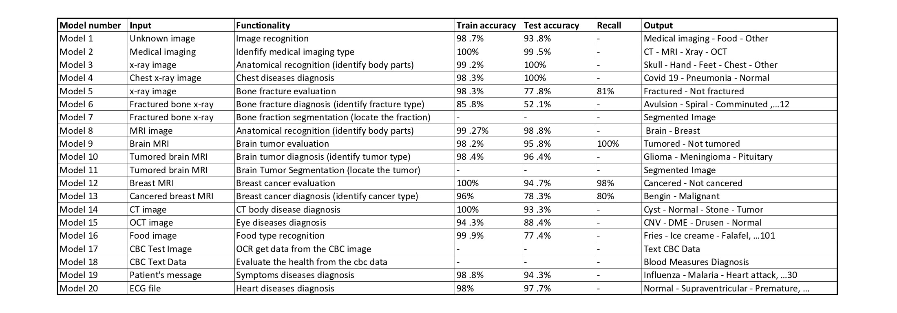

---

**AI Scan Models Work Flow**

Sequence for the Image Scan Computer Vision Models

---

**ChatBot Diseases Detection**

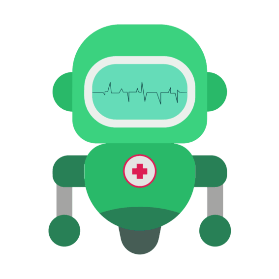

AI based smart chatbot called "Caroline" talking to the patient and taking its disease symptoms by text or voice messages, then diagnosing the disease and recommend making some tests or medical imaging scans to do as x-ray, MRI, Complete Blood Count CBC, ... in addition, given information about the predicted disease as an overview, symptoms, and treatments.

---

**Object Recognition From Iamges**

Identify the medical imaging scan, medical test report and food from images

---

**Medical Imaging Scan Type Detection**

Identifying the medical imaging scan type of 4 main types which are 'Electromagnetic Variations - Xray', 'Magnetic Resonance Imaging - MRI', 'Computerized Tomography - CT', or 'Optical Coherence Tomography - OCT'

---

**Anatomical Recognition From Xray Scan**

Applying anatomical recognition on all imaging types to identify the body parts

---

**Brain Tumor Detection From MRI Scan**

Can to detect brain tumor from MRI and diagnosis their types as 'Glioma_tumor', 'Meningioma_tumor', and 'Pituitary_tumor'

---

**Bone Fracture Detection From Xray Scan**

Can to detect bones fraction from x-rays and diagnosis their 10 types as 'Avulsion fracture', 'Comminuted fracture', 'Compression-Crush fracture', 'Fracture Dislocation', 'Greenstick fracture', 'Hairline Fracture', 'Impacted fracture', 'Intra-articular fracture', 'Longitudinal fracture', 'Oblique fracture', 'Pathological fracture', and 'Spiral Fracture'

---

**Breast Cancer Detection From MRI Scan**

Can detect breast cancer from MRI and diagnosis its types 'Malignant' or 'Benign'

---

**Brain Tumor Segmentation From MRI Scan**

Can locate the tumor location and color it

---

**Bone Fraction Segmentation From Xray Scan**

.jpg)

Can locate the fraction in bones location and make a rectangles on them

---

**Chest Diseases Detection From Xray Scan**

Can detect chest diseases from x-rays and diagnosis if there is 'Covid 19' or 'Pneumonia'

---

**Body Diseases Detection From CT Scan**

Can detect body diseases from CT scans and diagnosis if there is 'Cyst', 'Stones' or 'Tumors'

---

**Complete Blood Count Test (CBC) Medical Test**

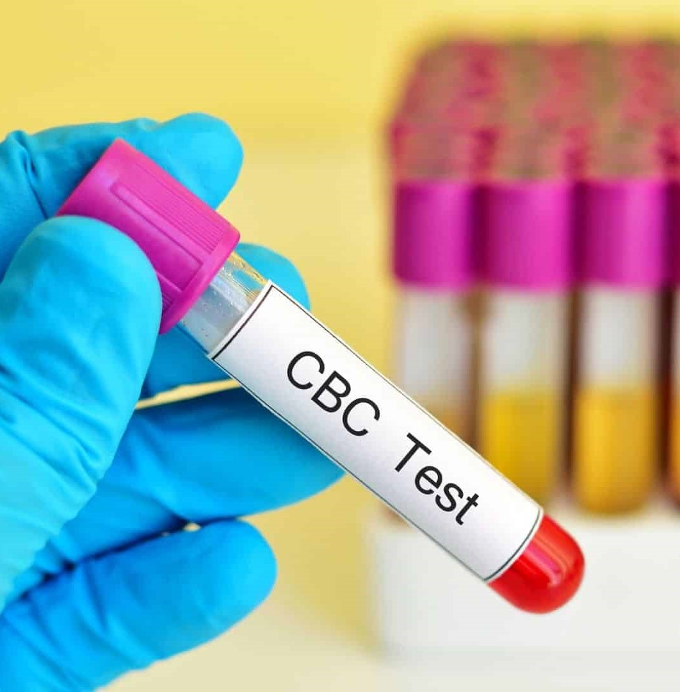

Using Optical Character Recognition OCR technique to get the data from the CBC image then pass it to a Large Language Model LLM to evaluate overall health and diagnose conditions like anemia, infections, clotting disorders, and blood cancers by analyzing red and white blood cells, hemoglobin, hematocrit, and platelets.

---

**ECG - Heart Diseases Detection**

Can detect heart diseases from Electrocardiography - ECG and diagnosis if there is 'Normal beat', 'Supraventricular premature beat', 'Premature ventricular contraction', 'Fusion of ventricular and normal beat', or 'Unclassifiable beat'

---

**Eyes Diseases Detection From OCT Scan**

Can detect eyes diseases from OCT scans and diagnosis if there is 'CNV - Choroidal Neovascularization', 'DME - Diabetic Macular Edema' or 'Drusen'

---

**Food Calories Detection**

Can detect food types from images and identify their approximation number of calories per gram. It can detect 101 types of food as 'Frensh fries', 'Pizza', 'Sushi', 'Pancakes', 'Chocolate cake', ...

---

## 3. Results

**AI Models Table**

Contains Input, Output, Functionality, Training and Testing Accuracy, and Recall information

---

**Models Accuracy**

Models Accuracy Visualization

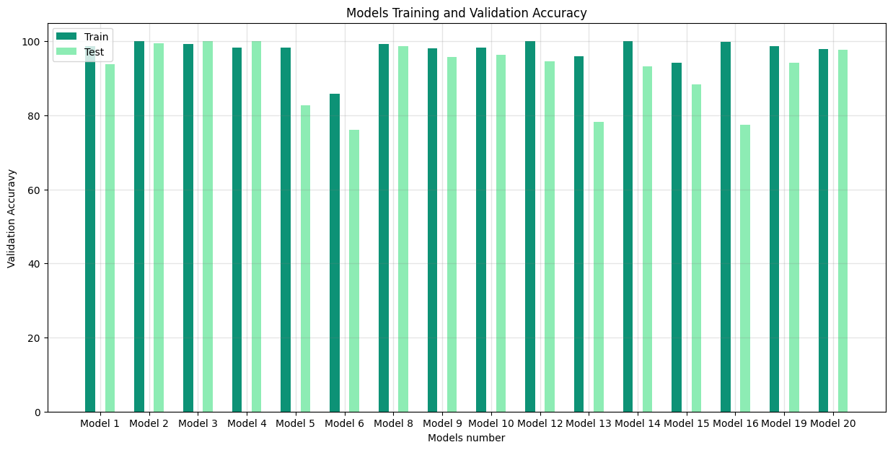

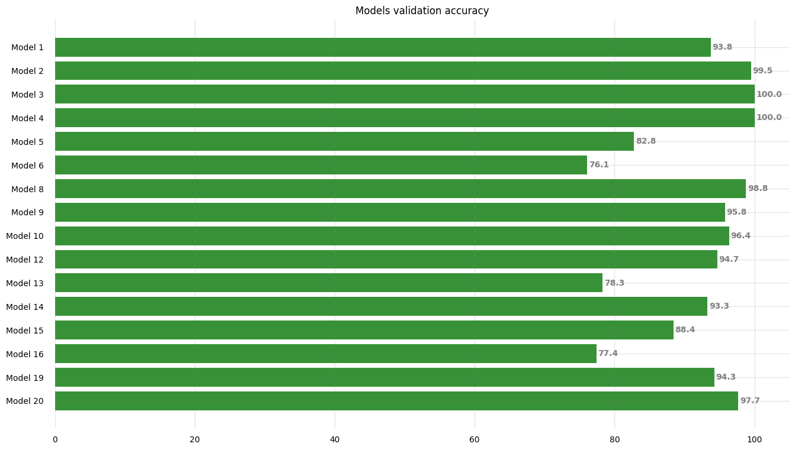

---

**Some Models Training History Visualization**

Chatbot Training History

Breast Cancer Detection Training History

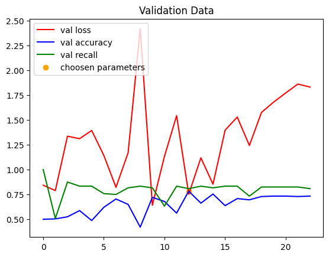

CT Model Training History

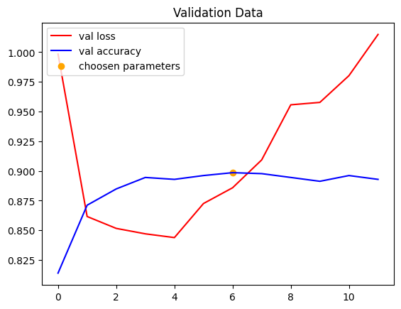

---

**Some Models Heatmap Visualization**

Breast Cancer Evaluation

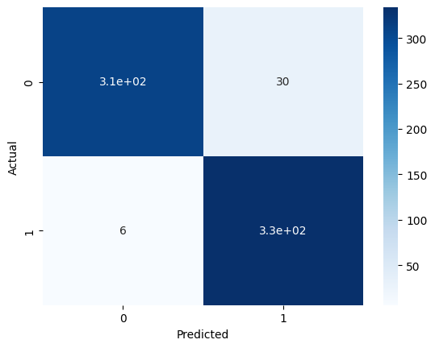

CT Scan Heatmap

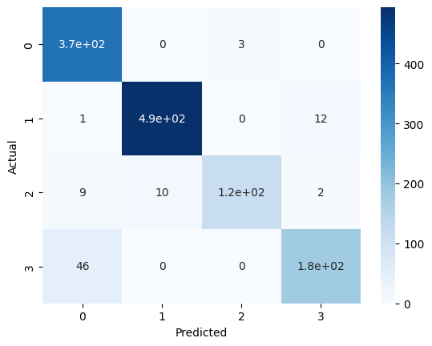

Medical Imaging Scan Type Detection Heatmap

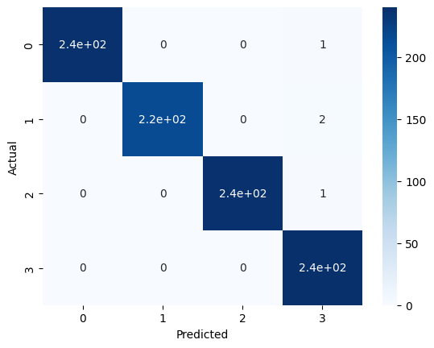

Chatbot Heatmap

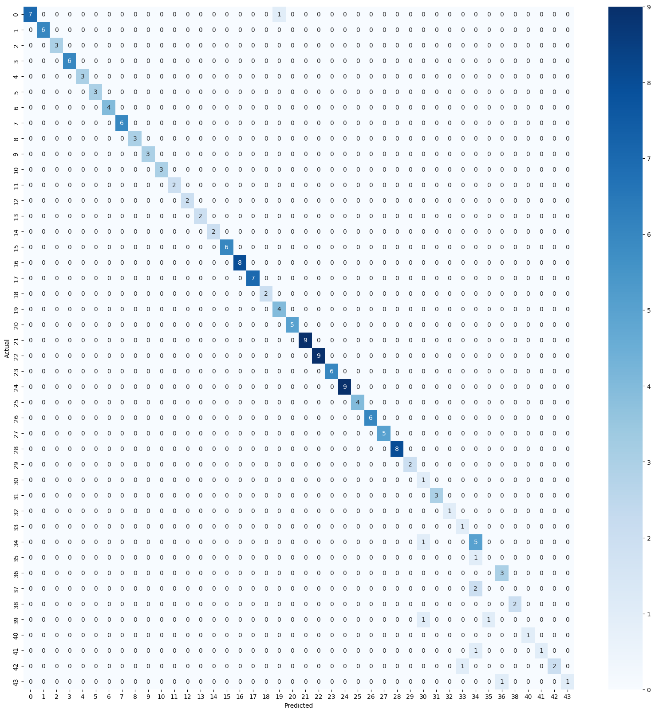

---

## 4. References
datasets
